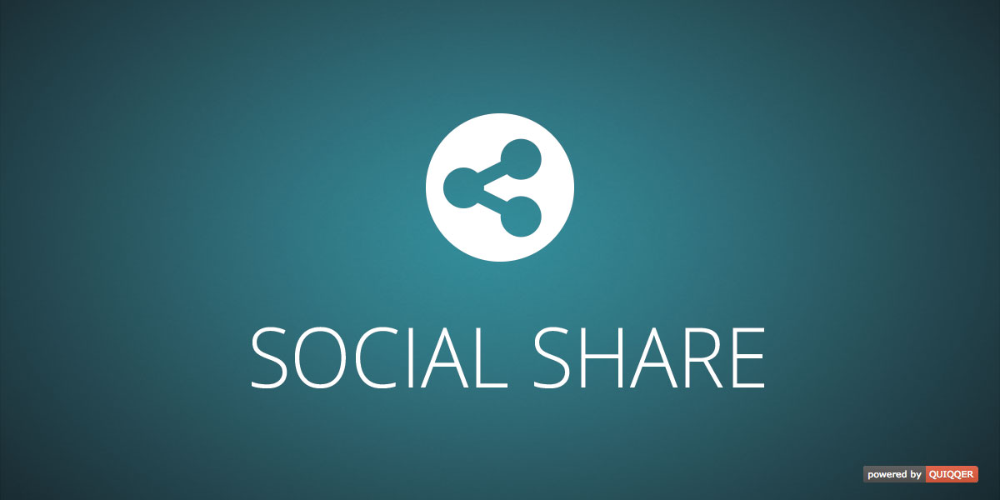

Social share
========

This plugin allows you to simply place social share buttons on your website.
It supports the most popular social networks like Facebook, Twitter, Pinterest, etc.

Package name:

    quiqqer/socialshare

Features
--------

- Different themen
- Icons and label may be disabled
- Extends the site head area (Open Graph and Schema.org)
- Additional site settings (titel, author, site typ, etc.)

Installation
------------

The package name is: quiqqer/socialshare

Contribute
----------

- Project: https://dev.quiqqer.com/quiqqer/socialshare
- Issue Tracker: https://dev.quiqqer.com/quiqqer/socialshare/issues
- Source Code: https://dev.quiqqer.com/quiqqer/socialshare/tree/master

Support
-------

If you have found a bug or want to make improvements,
then you can write an e-mail to support@pcsg.de.

License
-------

GPL-3.0+