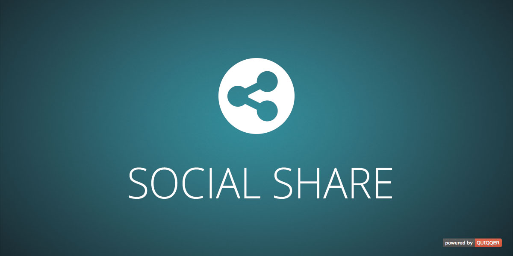

# Social Share

This plugin allows you to simply place social share buttons on your website.
It supports the most popular social networks like Facebook, Twitter, Pinterest, etc.

## Features

- Different themes
- Icons and label may be disabled
- Extends the site head area (Open Graph and Schema.org)
- Additional site settings (title, author, site type, etc.)


## Requirements

- PHP 8.2 or newer
- QUIQQER 2.x

## Installation

```shell
composer require quiqqer/socialshare
```

## Development

```shell
composer dev:init
composer test
```

## Contributing

- Project: https://dev.quiqqer.com/quiqqer/socialshare
- Issue Tracker: https://dev.quiqqer.com/quiqqer/socialshare/issues
- Source Code: https://dev.quiqqer.com/quiqqer/socialshare


## Support

If you have found a bug or want to make improvements,
then you can write an e-mail to support@pcsg.de.

## License

GNU General Public License v3.0 or later (`GPL-3.0-or-later`).
